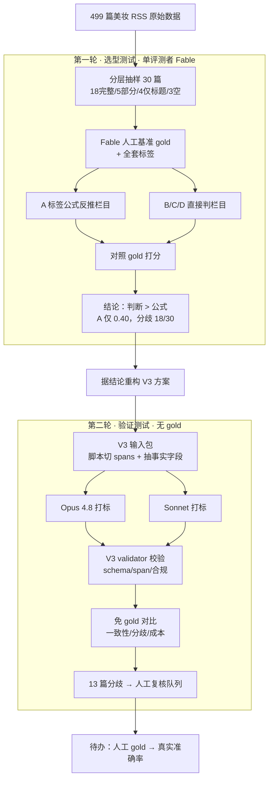
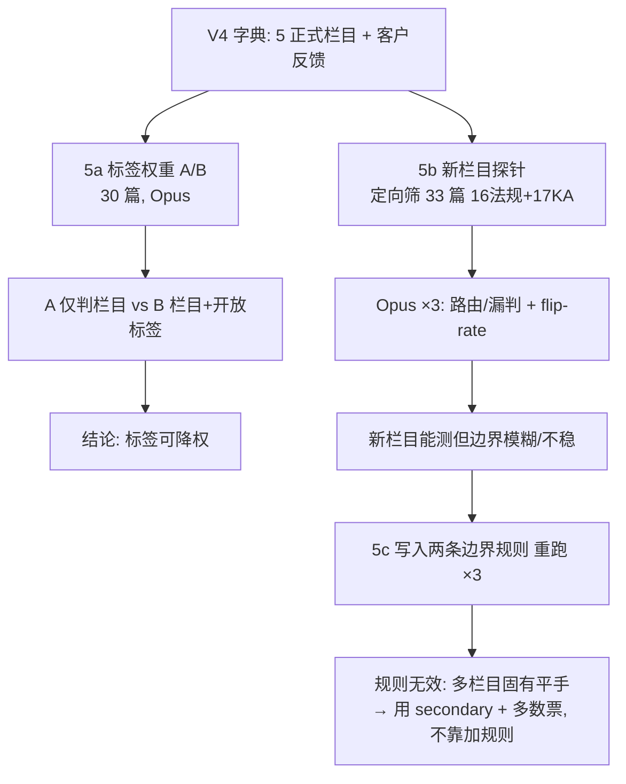

# 栏目打标测试 · 内部 Catch-up 报告（2026-06-11）

> 给团队快速了解今天做了什么、得到什么结论、改了什么、下一步怎么走。
> 详细数据见 `analysis/` 下各文件；本报告只做汇总。

**核心结论一句话**：栏目（newsletter 板块）必须由 AI **整体判断**，不能用"标签公式反推"；
据此重构出 V3 方案，并已用 Opus 4.8 / Sonnet 双模型验证了 V3 的关键改动有效。

---

## 0. 补充解释：方案是怎么演化的（C+D → 第三轮后的定版）

> 报告多处提到 "C+D 混合""V3 方案"。0.1–0.5 讲 C+D 的由来（理解用）；**0.6 是第三轮后的最新定版**
> ——若只想看现在怎么做，直接读 0.6。

### 0.1 C 和 D 原本各是什么（测试一里的定义）

- **C = "先判栏目 + 轻量标签"**：AI 读全文，**先整体判栏目**，再顺手打几个语义标签（故事类型、
  成分、功效、场景）。强项是栏目判得准、标签有搜索价值；弱点是让 AI 连公司名、成分名这种
  "照抄就行"的事也做，浪费。
- **D = "脚本提示 + AI 判栏目"**：**脚本**先把事实性的东西抽出来（公司、成分、活动词）当线索，
  AI 再判栏目。强项是事实抽得又准又便宜；弱点是它本身没规定 AI 要输出哪些语义标签。

C 的短板正好是 D 的长板（事实抽取），D 没覆盖的正好是 C 的强项（栏目判断 + 语义标签）。
所以 V3 把两者合起来。

### 0.2 V3 = C+D，具体是一条"两段式"流水线

```text
【第一段 · 脚本段（D 的部分）】 确定性，不用 AI
  清洗/入库脚本：
    - 写基础字段：id / 标题 / 正文 / 来源 / 语言 / 地区 / URL / 时间
    - 切 spans：把"标题+正文"按句切成带编号的句子 s0, s1, s2 …
    - 抽事实字段：company（NER+名单别名）、ingredient_mentions（成分别名表）、
                  is_event + event_type（活动关键词）、fact_hints
        ↓ 产出一个"文章包"（基础字段 + 事实字段 + spans）

【第二段 · AI 判断段（C 的部分）】 LLM，一篇一判
  小龙虾读这个文章包，输出：
    1) relevance       —— 准入闸门（相不相关）
    2) section         —— 整体判栏目：primary_section + secondary_sections
                          + evidence{ trigger_span_id 指针, inferred_because 一句话 }
                          ★ 是读懂全文判的，不是用标签反推
    3) 轻量语义标签     —— primary_story_type（实质类型）、ingredient_technology（主轴+other:）、
                          functional_claim、product_application
        ↓
【第三段 · 脚本校验段】
  validator 校验：schema 合规 / span 指针存在 / 决策一致 / 禁置信度 / 禁脚本字段回流
```

### 0.3 谁干什么：分工表

| 产出 | 谁来做 | 属于 |
|---|---|---|
| 基础字段、spans 切句 | 脚本 | D |
| company、ingredient_mentions、is_event/event_type | 脚本 | D |
| relevance（相关性闸门） | AI | C |
| section（栏目落位 + 证据指针） | AI | C |
| story_type、成分主轴、功效、场景 | AI | C |
| 证据 = span 指针（不转写）、不打置信度 | 规则约定 | V3 |

**核心原则**：能脚本确定的（事实/切句）交脚本；必须读懂语义才能判的（相关性、栏目、语义标签）
交 AI。这就是 C+D 的本质——不是两条腿分别跑，是"脚本段喂给 AI 段"的一条流水线。

### 0.4 举个具体例子（亚什兰那篇 webinar 发新原料）

**第一段脚本产出**：
- company = [亚什兰]
- ingredient_mentions = [ ]（成分表没命中"可可光护因子"这种新词）
- is_event = true，event_type = webinar
- spans = [s0 标题, s1, s2, s3 "亚什兰升级发布…可可光护因子 blumilight", …]

**第二段 AI 产出**：
- relevance = relevant
- section.primary = competitor_watch，secondary = [market_event, technology_innovation]
- evidence = { trigger_span_id: s3, inferred_because: "供应商发新活性物是实质，webinar 只是场合" }
- tags: story_type=[product_launch_or_update, technology_process_innovation]，
  ingredient_technology=[other:cocoa_opsin_blumilight, plant_botanical_extracts]，
  functional_claim=[blue_light_protection]，product_application=[skincare]

看这里就懂 C+D 的配合："是 webinar"是脚本判的（is_event），但"主栏目是竞品动态不是市场活动"
是 AI 判的——脚本提供事实，AI 做实质判断。这正是 V3 解决"活动劫持"的关键：活动只是脚本记录的
一个事实属性，不再有资格抢栏目。

### 0.5 几个要点澄清

- **测试二跑的就是这套 V3（C+D）**，放在 Opus 和 Sonnet 两个模型上，不是 B/C/D 分开跑。
- **证据是"指针"不是"引文"**：AI 只回 s3 这个编号，不誊写句子——省 token、防幻觉，后端按编号回填原句。
- **不打置信度**：质量靠人工抽检 + needs_review（客观态）。
- **V4 只换了栏目清单**（客户要求：合并成分+技术、加法规、KA监测升为栏目；行业快讯/热点改报告 Agent
  下游编排），C+D 的两段式机制本身没变。

> ⚠️ 上面 0.1–0.5 描述的是"AI 段同时判栏目 + 打轻量标签"的 C 设计。**第三轮把这一点改了**，见 0.6。

### 0.6 第三轮后的定版（当前实际方案）

第三轮 A/B 测试结论是**标签降权**（详见第 6–7 节）：让 AI 在判栏目之外**还打标签，不提升栏目准确率
却让成本翻倍**。所以现在定版为：

- **AI 段只做两件事**：`relevance`（宽进闸门）+ `section`（栏目落位 + 指针证据），外加**可选**
  `report_guidance`（偶尔一句话提醒报告 Agent）。**AI 不再打描述标签。**
- **描述标签（成分/功效/场景/故事类型）下放给脚本/展示层**；若保留，**必须套字典 picklist**
  （第三轮证明开放词碎片化会毁搜索）。
- **多栏目文章**（如原料商发新成分 = 竞品动态 + 成分趋势）：不追求单一 primary 确定性，
  用 `secondary_sections` 承载共属栏目，报告 Agent 下游去重/择一展示。
- 其余机制不变：脚本切 spans + 抽事实字段、指针证据、不打置信度、needs_review 隔离。

> **当前一句话总结**：脚本把事实+句子+脚本标签准备好 → **AI 只判相关性 + 栏目（指针给证据，偶尔
> 补一句 report_guidance）** → 脚本校验 → 报告 Agent 用栏目落位、必要时在脚本标签里筛选展示。

| 维度 | 0.1–0.5 的 C+D（旧） | 0.6 定版（第三轮后） |
|---|---|---|
| AI 段是否打描述标签 | 打（轻量语义标签） | **不打**（只 relevance + section） |
| 描述标签来源 | AI | **脚本/展示层（套字典）** |
| 多栏目处理 | — | **secondary_sections + 报告 Agent 去重** |
| 理由 | 设计设想 | A/B 实测：兼做打标不提栏目、成本翻倍 |

---

## 1. 测试设计与执行

今天做了**两轮**测试，目的不同：第一轮**选型**（用哪种范式），第二轮**验证**（V3 改动有没有用）。

### 1.1 流程图



### 1.2 第一轮：四框架选型（单评测者）

| 项 | 内容 |
|---|---|
| 分组 | **A** 全标签→规则反推栏目；**B** 直接判栏目；**C** 栏目+轻标签；**D** 脚本提示+判栏目 |
| 考察指标 | 主栏目准确率、错留垃圾数、A-vs-判断分歧、相对 token 成本 |
| 关键限制 | 单评测者：gold 和判断都是 Fable，B/C/D 满分是**循环**，只作自洽参考 |

**结果**：A 主栏目准确率 **0.40**、错留垃圾 **9/30**、与判断分歧 **18/30**；成本 A=100、C=42、B=32。
公式失败有四类可复现模式：无相关性闸门、活动标签劫持、竞品名盖故事、汇编推不出。

**第一轮结论**：栏目用 AI 整体判断；标签只用于搜索/证据/趋势，不决定栏目。

### 1.3 第二轮：V3 双模型验证（无 gold）

| 项 | 内容 |
|---|---|
| 分组 | **Opus 4.8** 与 **Sonnet** 各独立按 V3 prompt/schema 跑 30 篇；Fable 仅编排打分 |
| 考察指标（免 gold） | 模型间一致性、分歧定位、schema/span 合规、输出体量 |

**结果**：
- ✅ **第一轮头号问题"活动劫持"已消除**：供应商在 webinar/展会发料的文章，两模型都不再误判 market_event。
- ✅ **指针证据机制可用**：两模型 0 个非法 span 指针。
- ✅ **标志位比主栏目稳**：customer_watch 一致 93%、market_brief 83%（印证"降标志位"对）。
- ⚠️ **主栏目仅 57% 一致**（top-2 70%）：约 4 成文章栏目有真歧义，集中在 3 条边界。
- ⚠️ **契约对模型敏感**：Opus 0 schema 错；Sonnet 漏"每标签证据指针"、误用 suggested_new_tags。
- 行为差异：Sonnet 对薄正文更保守（needs_review 4 vs Opus 1）；输出体量 Opus 1057 / Sonnet 1293 字/篇。

### 1.4 两轮对比与总结

| | 第一轮 | 第二轮 |
|---|---|---|
| 性质 | 选型（哪种范式） | 验证（V3 改动有没有用） |
| 评测者 | 单（Fable，有循环） | 双模型（Opus/Sonnet，无 gold） |
| 能得的结论 | 公式 vs 判断（结构性） | 一致性/合规/成本/难点定位 |
| 产出 | "用判断，不用公式" | "V3 修好了活动劫持、指针机制可用、但栏目仍有 43% 歧义待人裁" |

**合起来**：第一轮**定方向**（判断派胜出），第二轮**验证 V3 把方向落对了**（event 拆轴、标志位、
指针证据都成立），并**精确定位**了还需人来定调的 13 篇——为接下来的人工 gold 指明了重点。

---

## 2. 产出文件

**测试脚本**（`product/output/test-results/section-tagging-test/scripts/`）
- `make_pilot_sample.py` 分层抽样 + 切 spans + 生成脚本字段（产出 v2/v3 两套输入包）
- `score_frameworks.py` 四框架打分 + A-vs-判断分歧
- `sweep_tag_scriptability.py` 标签"脚本可抽性"实测
- `compare_runs.py` 双模型免 gold 对比
- `make_gold_review_md.py` 生成人工审阅稿（自动标分歧）

**数据 / 结果**
- `fixtures/pilot-30-input.json`、`fixtures/pilot-30-input-v3.json`
- `gold-standard/pilot-30-annotations.json`（Fable 占位 gold）
- `gold-standard/pilot-30-gold-review.md`（**发给同事审阅，已标 13 篇分歧**）
- `runs/opus48-pilot30.json`、`runs/sonnet-pilot30.json`
- `analysis/pilot-30-findings.md`、`pilot-30-metrics.json`、`round2-gold-free-results.md`

**方案 / 文档**（`project-management/dev/docs/section-tagging-test/`）
- `团队分享-栏目打标测试.md`（活文档，含轮次1/2）
- `README-revisions-v2.md`（测试方案修订）、`标签体系优化建议-v2.md`
- `测试方案-第二轮-V3验证.md`、本报告

**字典 / Skill 的 V3 草稿**（V2 全部保留作对客基线）
- `product/parameter-file/tag-dictionary/标签字段字典-禾大美妆个护版-V3-draft.md`
- `product/skills/newsletter-tagging/references/llm_prompt-v3-draft.md`
- `product/skills/newsletter-tagging/schemas/tag_output-v3-draft.schema.json`
- `product/skills/newsletter-tagging/scripts/validate_tags_v3_draft.py`

---

## 3. 改动说明

### 3.1 字典改动（V2 → V3 草稿）

1. **新增 `section` 一等判断**（primary_section + secondary + 标志位 + 证据），栏目不再由标签反推。
2. **market_brief / customer_watch 降为标志位**，不再是互斥主栏目。
3. **`event_news` 从 story_type 删除**，拆成独立脚本字段 `is_event` + `event_type`。
4. **`company`、成分抽取下放为脚本字段**；AI 只判"主轴成分 / `other:` 新词"。
5. **证据改为"脚本切句 spans + AI `trigger_span_id` 指针"**，AI 不转写原文；分层（只有
   section/relevance/other 写"为什么 `inferred_because`"，描述标签只给指针）。
6. **取消置信度**；质量由人工抽检；`needs_review` 改为客观状态。
7. **`value_chain_stage` 降二期**并粗粒度化。

### 3.2 栏目-打标 Agent 编排改动

把"脚本能做的"和"必须 AI 判的"彻底分开，流程变成两段：

```
清洗/入库脚本：写基础字段 → 切 spans → 抽事实字段(company/成分/is_event)
        ↓
AI（小龙虾）：判 relevance → 判 section（整体，不反推）→ 打轻量语义标签 → 指针证据
        ↓
脚本：validate_tags_v3_draft.py 校验（schema / span 存在 / 决策一致 / 禁置信度 / 禁脚本字段回流）
```

配套：V3 prompt、V3 schema、V3 validator（带 `--article` span 交叉校验）均已出草稿并实测。

### 3.3 当前"栏目-打标"功能开发状态

- **范式已定**：栏目=AI 一等判断，标签=轻量辅助，事实=脚本。
- **链路已通**：Opus/Sonnet 在 V3 输入包上端到端跑通，validator 可校验。
- **仍是草稿**：V3 未合入正式版，V2 仍是对客基线；**等客户确认栏目框架 + 人工 gold 后**再合 V3 正式版。
- **未做**：活字典 other 晋升流程、value_chain、搜索/报告下游、真实数据库写入（MVP 仍文件驱动）。

---

## 4. 后续规划建议

### 4.1 立即（解锁准确率）
- **人工 gold**：≥2 人按 `pilot-30-gold-review.md` 独立标，**优先裁 13 篇分歧**，对齐后产出正式 gold。
- **定证据契约**：每标签强制指针 vs 仅关键判断指针——影响成本与 Sonnet 合规率，需拍板。
- **收紧 3 条模糊边界**的 prompt/定义：相关性边界、competitor↔ingredient、薄正文 needs_review。

### 4.2 数据库建设构想
- **MVP（禾大）维持文件驱动**：`待打标.json → tagging.json`，不引入数据库。
- **产品化（后续行业）再上库**：表结构需支撑——文章表、section 落位 + 标志位、轻量标签关联表、
  **spans/指针证据**（按 id 回填句子供月报/搜索展示）、脚本事实字段、Watchlist、
  `inline_other_terms`/`taxonomy_terms`（活字典）。**关键设计点**：栏目与标签解耦后，
  加标签/晋升 other 不影响栏目落位逻辑，分期扩展安全。

### 4.3 Agent 建设构想
- **两段式固化**：脚本段（事实/切句）+ AI 段（判断），中间用 schema 卡边界。
- **复核队列路由**：needs_review / 低证据 / 新 other 自动进人工抽检，而非每篇都看。
- **多趟分层**：MVP 只跑"栏目+轻标签"便宜一趟；高价值文章再跑"全标签富化"趟
  （即旧框架 A 作为增强，不作栏目引擎）。
- **跨月沉淀**：轻量标签按月累积 → 支撑跨月横比、知识库、客户专题回顾（如"欧莱雅所有动态"）。

### 4.4 下一步测试计划（还值得测什么）
1. **扩 120 篇 + 时间窗口多源数据**（待 Alexi 抓取），罕见栏目补足样本。
2. **放宽版证据契约**对比测：合规率/成本/可读性。
3. **3 条边界 tie-break 规则**专项测：能否把 57% 一致率提上去。
4. **稳定性 3× 重跑**（仅模糊簇）：测 section_flip_rate。
5. **下游可用性探针**：搜索召回（欧莱雅/PDRN/PCHi）+ 报告撰写可用性。
6. **国产模型迁移**（Kimi/MiniMax，团队外部跑后导入）：定厂商成本。
7. **跨月趋势聚合**：等多月数据后验证知识库价值。

> 提醒：30 篇是精挑样本，准确率会偏乐观；真实场景（几千篇）单篇准确率不降但长尾变广，
> 规模化质量靠"复核队列 + 抽样监控"守，不靠无限加测。

---

# 第三轮 · 标签权重 & 新栏目验证（2026-06-16/17，V4 字典）

> 第一/二轮回答"用判断不用公式""V3 改动有效"；第三轮回答两个新问题：
> ①**标签权重是不是太高、该不该降为展示点缀**；②**V4 两个新栏目（ka_watch / regulation_policy）能不能测、稳不稳**。
> 模型全部 Opus 4.8；gold 用模型银标（不做人工 gold，按用户决定，只看相对结论）。

## 5. 测试设计与执行（第三轮）

第三轮分三步，层层递进：



### 5a 标签权重 A/B（30 篇，分组）

| 组 | Agent 干什么 | 描述标签来源 |
|---|---|---|
| **A** | 只判 relevance + section（+可选 report_guidance） | 第一层脚本（固定值） |
| **B** | 在 A 基础上**额外**开放打标（不查字典） | 脚本固定值 + Agent 开放补充 |

考察：标签是否拖累栏目（A vs B 栏目准确率）、成本、B 开放词碎片化、relevance 宽进、隔离门槛。

### 5b 新栏目探针（定向 33 篇）

30 篇里 ka_watch=1、regulation_policy=0，测不了 → 关键词**标题强信号**从 499 筛出 16 法规 + 17 KA，
Opus **跑 3 次**，看实判**路由/漏判**与 **flip-rate**（候选池标签只是"标题像"，非答案）。

### 5c 写入边界规则后重跑

针对 5b 发现的 reg↔ingredient、ka↔exclude，在字典+prompt 写两条边界细则，同 33 篇再 ×3。

## 6. 结果与指标（第三轮）

### 6a A/B：标签可以降权

| | A 仅判栏目 | B 栏目+开放标签 |
|---|---:|---:|
| 主栏目准确率(vs V4 银标) | **70%** | 67% |
| A vs B 主栏目一致 | \ | **90%** |
| 输出体量(字符/篇，成本代理) | **629** | 1167 |

- **让 Agent 兼做打标不提升栏目（差 1 篇，无显著差异），却让输出成本约翻倍。**
- B 开放词 `ingredient_technology` 在 30 篇里出现 **38 个不同值**（同义碎片化）→ 自由词毁搜索/聚合。
- relevance vs gold 双双 93%、**错杀有用 0**（宽进闸门成立）；**needs_review = 0**（穷尽标题+脚本字段+来源的隔离门槛有效）。
- report_guidance 用得克制（A 5/30、B 7/30），没滥用。

### 6b 新栏目探针：能测，但边界模糊 + 不稳

| 候选池 | 多数判进目标栏目 | 主要漏向 |
|---|---|---|
| regulation 16 篇 | **9/16 = 56%** → regulation_policy | 5 漏到 ingredient_innovation |
| ka 17 篇 | **4/17 = 24%** → ka_watch | **8 进 exclude**（纯品牌/公益/诉讼，正确排除） |

- **flip-rate**：3 次完全一致 **76%（25/33）**，24% 至少翻一次；翻动**全部集中在两个新栏目的边界**。
- 这直接回答"同模型会不会翻"：**会，约 24%，但只在边界文章、专发于新栏目相邻处**；清晰文稳定。
- **ka_watch 是个很窄的筐**：KA 品牌文大多本就不该进（无成分角度→exclude），实际月份可能很少甚至为空。

### 6c 写入规则后：规则无效（诚实负面结果）

| 指标 | 原规则 | 收紧后 |
|---|---|---|
| reg → regulation_policy | 56% | **56%（没变）** |
| ka → ka_watch | 24% | **24%（没变）** |
| flip/33 | 24% | **30%（略升，噪声内）** |

**为什么没用**：对仍翻的 10 篇，翻动的 primary **100% 落在该文自己的(主+次)栏目并集内**——
模型始终识别出同一组 2–3 个共属栏目，只是轮流挑主。不是判错，是这些文**本就同时属于多个栏目**
（如原料商发/备案新成分 = 竞品动态 + 成分趋势 + 法规，三者皆成立）。最大的不稳轴其实是
**competitor_watch ↔ ingredient_innovation（供应商发新成分）**，一条规则切不干净。

## 7. 第三轮结论与 insight

1. **标签降权落地**：栏目-标签 Agent 只做 relevance + section（+偶尔 report_guidance）；描述标签交脚本/展示。
   栏目准确率不降、成本砍半。**若保留标签必须套字典 picklist**（开放词碎片化毁搜索）。
2. **多栏目不稳是固有的，不是定义缺口——加 prompt 规则按不下去**。正确机制是结构性的：
   用 `secondary_sections` 承载共属栏目；度量改看**section 集合 / top-2**（primary 落在并集内 73%，
   远高于精确一致 70%，大部分"翻动"无害）；要压抖动靠**多次多数票**，不靠规则。
3. **"准确率不是 100%"的真因**：单评测者银标下，70% 主要是 **Opus 与 Fable 银标的跨评测者吻合度** +
   **共属栏目的主次轮换**，**不是同模型自我矛盾**（后者仅占边界少数）。
4. **新栏目现状**：regulation_policy 向 ingredient 漏、ka_watch 很窄且不稳；需向客户说明 ka_watch 可能
   常态偏空，并在报告 Agent 端做栏目去重/择一展示。
5. **relevance 宽进 + 隔离门槛 + report_guidance** 三机制均按预期工作。

## 8. 产出文件（第三轮新增）

- `scripts/`：`remap_gold_v4.py`、`score_round3.py`、`build_probe_candidates.py`
- `fixtures/`：`probe-candidates.json`（定向 33）
- `gold-standard/`：`pilot-30-gold-v4.json`（V4 重映射银标）
- `runs/`：`A-opus48-v4.json`、`B-opus48-v4.json`、`probe-run{1,2,3}.json`、`probe2-run{1,2,3}.json`
- `analysis/`：`round3-tag-weight-AB.md`、`round3b-newsection-probe.md`
- V4 草稿：字典 `标签字段字典-禾大美妆个护版-V4-draft.md` + skill 三件套
  `llm_prompt-v4-draft.md` / `tag_output-v4-draft.schema.json` / `validate_tags_v4_draft.py`

> 数据完整性说明：第三轮过程中误删过 test-results 工作树（仓库重构把它从 `output/` 移到
> `parameter-file/`，rm 时连带删除且该树未入 git）。已从会话记录 + `all-articles` 源**确定性重建**
> （30 篇 ID 一致，A/B/探针运行结果未受影响）。教训：未确认内容且未入 git 的目录不用 `rm -rf`。

## 9. 改动说明（第三轮）

- **字典 → V4 草稿**：合并成分趋势+技术创新为 `ingredient_innovation`、新增 `regulation_policy`、
  `customer_watch→ka_watch`、行业快讯/热点改报告 Agent 下游编排（非打标标签）、删 color_cosmetics 留卸妆、
  加 teen_age_care/hair_strands/enhance_penetration、green_chemistry→sustainability_chemistry、
  Watchlist 按客户名单补全；新增**可选 `report_guidance`**（单条字符串）、**needs_review 隔离门槛**、
  **两条边界细则**（reg↔ingredient、ka↔exclude；经测无效，待定保留/回退）。
- **Agent 编排**：relevance 宽进 + 与 section 耦合（无法落栏目则回落 exclude；薄文先用标题+脚本字段判，
  实在判不了才隔离、不传下游、待人工周期审计）。
- **当前状态**：V4 仍为草稿，待客户确认栏目结构与开放问题（成人 oral_care 归属、ka_watch 可能偏空）后合入。

## 10. 第三轮后的下一步

1. **边界规则去留**：建议**保留 ka↔exclude（方向有益、防 KA 滥收）**，**回退/弱化 reg↔ingredient**（无效且增长 prompt）。
2. **把"供应商发新成分"定为 competitor_watch 与 ingredient_innovation 等价**（度量上不算错），主次轮换交 secondary + 报告 Agent 去重。
3. **度量改用 section 集合 / top-2 + 多数票**，不再盯单一 primary 精确匹配。
4. **扩 120 + 定向补样**仍待 Alexi 多抓 regulation/KA 真实文章；ka_watch 需更多真样本才能定论。
5. 改完后**重跑 33 篇探针看 flip 是否下降**，作为规则/机制有效性的直接验证。
